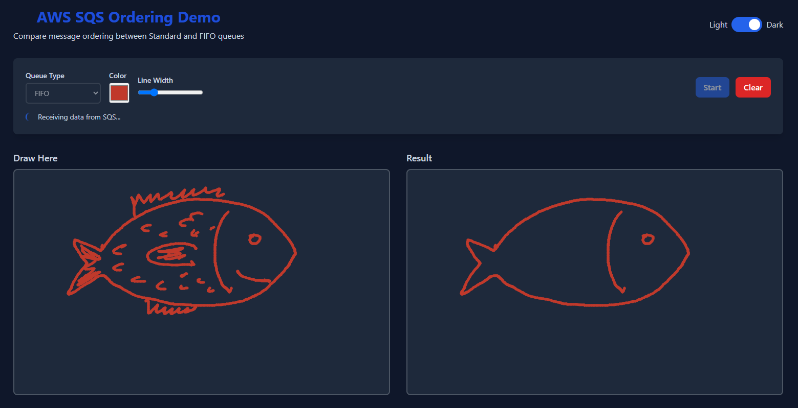

# AWS SQS Ordering Demo - Serverless Version

Fully serverless implementation using AWS SAM, API Gateway, Lambda, and S3 showcasing how messages are processed in different SQS queue types (Standard vs FIFO) with a visual drawing interface.



## Architecture

- **S3**: Static website hosting
- **API Gateway**: REST API endpoints
- **Lambda**: SQS operations (send/receive)
- **SQS**: Standard and FIFO queues

## Prerequisites

1. **AWS CLI** configured with credentials
2. **AWS SAM CLI** installed
3. **Node.js 20+**

## Quick Start

### 1. Deploy Backend

```powershell
# Build and deploy
sam build
sam deploy --guided

# Deploy with more options
sam deploy --guided --region <your-aws-region> --profile <your-named-profile>

# Note the API Gateway URL from outputs
```

### 2. Update Frontend

Replace `API_GATEWAY_URL_PLACEHOLDER` in `frontend/js/client.js` with your API Gateway URL.

### 3. Deploy Frontend to S3

```powershell
# Upload to S3 bucket (use bucket name from SAM outputs)
aws s3 sync frontend/ s3://YOUR-BUCKET-NAME --delete

# With a named profile
aws s3 sync frontend/ s3://YOUR-BUCKET-NAME --delete --profile <your-named-profile>
```

### 4. Access Application

Open the S3 website URL from SAM outputs.

## Local Development

**Prerequisites:** Your AWS CLI profile must have SQS permissions (`sqs:SendMessage`, `sqs:ReceiveMessage`, `sqs:DeleteMessage`) for the test queues.

### Step 1: Start Backend API

```powershell
# Set environment variables for local testing
$env:STANDARD_QUEUE_URL = "https://sqs.REGION.amazonaws.com/ACCOUNT_ID/QUEUE_NAME"
$env:FIFO_QUEUE_URL = "https://sqs.REGION.amazonaws.com/ACCOUNT_ID/QUEUE_NAME.fifo"

# Start API locally
sam local start-api
```

```bash
# Set environment variables for local testing
export STANDARD_QUEUE_URL=https://sqs.REGION.amazonaws.com/ACCOUNT_ID/QUEUE_NAME
export FIFO_QUEUE_URL=https://sqs.REGION.amazonaws.com/ACCOUNT_ID/QUEUE_NAME.fifo

# Start API locally
sam local start-api
```

### Step 2: Update Frontend Configuration

In `frontend/js/client.js`, replace `API_GATEWAY_URL_PLACEHOLDER` with `http://localhost:3000`

### Step 3: Serve Frontend

**Option A: Python**
```bash
cd frontend
python -m http.server 8080
# Open http://localhost:8080
```

**Option B: Node.js**
```bash
cd frontend
npx serve -p 8080
# Open http://localhost:8080
```

**Option C: VS Code Live Server**
- Install "Live Server" extension
- Right-click `frontend/index.html` → "Open with Live Server"

### Troubleshooting CORS Issues

If you encounter CORS errors with `sam local start-api`, try:

1. **Use Chrome with disabled security (temporary):**
```bash
chrome --disable-web-security --user-data-dir="/tmp/chrome_dev"
```

2. **Alternative: Test with deployed API**
- Deploy to AWS and test with real API Gateway URLs

## Clean Up

```powershell
sam delete
```

## Environment Variables

Set in `template.yaml` or override during deployment:
- `StandardQueueName`: Standard queue name
- `FifoQueueName`: FIFO queue name

## Costs

- **API Gateway**: ~$3.50/million requests
- **Lambda**: ~$0.20/million requests + compute time
- **SQS**: ~$0.40/million requests
- **S3**: ~$0.023/GB storage + requests

Estimated cost for demo usage: **< $1/month**

## What's Next?

Ready to enhance this demo? Here are some exciting features you could add:

### 🔐 **Authentication & Authorization**
- **Amazon Cognito Integration**: Add user authentication with sign-up/sign-in
- **API Gateway Authorizers**: Secure endpoints with JWT tokens
- **User-specific drawings**: Save drawings per authenticated user

### 📊 **Observability & Monitoring**
- **AWS X-Ray Integration**: Add distributed tracing across Lambda functions
- **CloudWatch Dashboards**: Monitor API performance and SQS metrics
- **Custom CloudWatch Metrics**: Track drawing completion rates

### 🚀 **Advanced Features**
- **Kinesis Data Streams**: Add as third option to compare streaming vs messaging patterns
  - Partition-level ordering with replay capability
  - Multiple consumers reading same drawing data
  - Demonstrates sharding effects on message ordering
- **DynamoDB Integration**: Persist drawing history and user preferences
- **WebSocket API**: Real-time collaboration on drawings
- **CloudFront CDN**: Global content delivery for better performance
- **EventBridge**: Trigger notifications when drawings are completed

### 🔧 **DevOps Enhancements**
- **Local SQS Testing**: Use LocalStack or ElasticMQ containers for offline development
  - No AWS credentials needed for local testing
  - Faster development cycle without network calls
- **CI/CD Pipeline**: Automated deployment with GitHub Actions or CodePipeline
- **Multi-environment**: Separate dev/staging/prod stacks
- **Infrastructure Testing**: Validate deployments with automated tests

### 📱 **User Experience**
- **Progressive Web App**: Offline support and mobile app-like experience
- **Drawing Templates**: Pre-built shapes and patterns
- **Export Features**: Save drawings as PNG/SVG files

**Contribution Welcome!** Fork this project and implement any of these features. Each enhancement teaches valuable AWS serverless patterns.